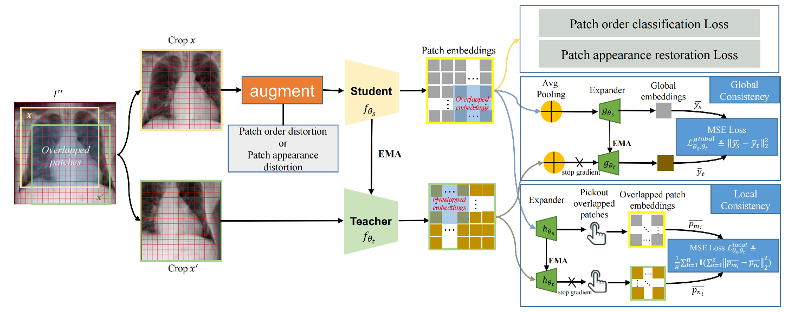
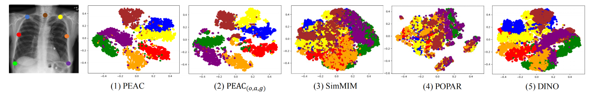
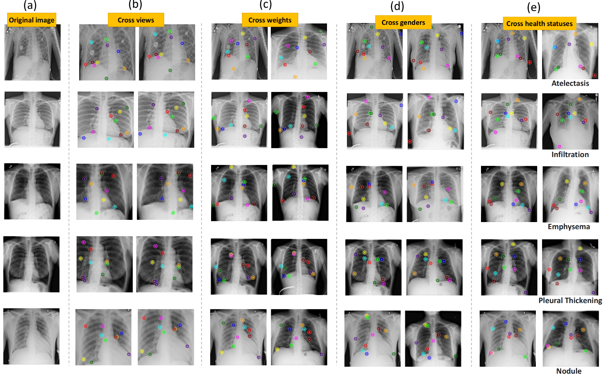
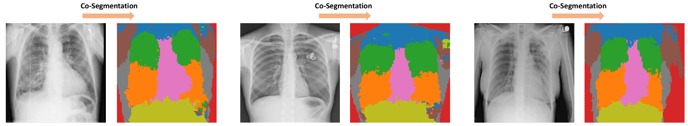

# Learning Anatomically Consistent Embedding for Chest Radiography
This is official code for our **BMVC 2023 Oral paper**:  
[Learning Anatomically Consistent Embedding for Chest Radiography](https://papers.bmvc2023.org/0617.pdf)

We have introduced a new self-supervised learning (SSL) method called *PEAC (patch embedding of anatomical consistency)*. Compared with photographic images, medical images acquired with the same imaging protocol exhibit high consistency in anatomy. To exploit this anatomical consistency, we propose to learn global and local consistencies via stable grid-based matching, transfer pre-trained *PEAC* model to diverse downstream tasks. *PEAC* (1) achieves significantly better performance than the existing state-of-the-art fully-supervised and self-supervised methods, and (2) can effectively captures the anatomical structure consistency between patients of different genders and weights and between different views of the same patient which enhances the interpretability of our method for medical image analysis. 



# Publication

**Learning Anatomically Consistent Embedding for Chest Radiography**<br/>
[Ziyu Zhou](https://scholar.google.com/citations?hl=en&user=nvAfKnsAAAAJ)<sup>1,2</sup>, [Haozhe Luo](https://roypic.github.io//)<sup>2</sup>, [Jiaxuan Pang](https://www.linkedin.com/in/jiaxuan-pang-b014ab127/)<sup>2</sup>, [Xiaowei Ding](https://ee.sjtu.edu.cn/en/FacultyDetail.aspx?id=200&infoid=153&flag=153)<sup>1</sup>, [Michael B. Gotway](https://www.mayoclinic.org/biographies/gotway-michael-b-m-d/bio-20055566)<sup>3</sup>, [Jianming Liang](https://search.asu.edu/profile/1310161)<sup>2</sup><br/>
<sup>1 </sup>Shanghai Jiao Tong University, <sup>2 </sup>Arizona State University, <sup>3 </sup>Mayo Clinic <br/>
(Ziyu Zhou and Haozhe Luo contribute equally for this paper.)<br/>

Paper ([BMVC offcial publication](https://papers.bmvc2023.org/0617.pdf), [Full version with appendix](https://arxiv.org/abs/2312.00335)) | [Poster](images/PEAC_poster_1027_v2.0.pdf) | [Presentation](https://www.bilibili.com/video/BV1wc411D7tg/?spm_id_from=333.999.0.0&vd_source=0199850c2eb71ce8f33bc8e329957840)


# Dataset
1. [ChestX-ray14](https://nihcc.app.box.com/v/ChestXray-NIHCC)
2. [CheXpert](https://stanfordmlgroup.github.io/competitions/chexpert/)
3. [RSNA Pneumonia](https://www.kaggle.com/c/rsna-pneumonia-detection-challenge)
4. [Shenzhen](https://lhncbc.nlm.nih.gov/LHC-downloads/downloads.html#tuberculosis-image-data-sets)
5. [JSRT](http://db.jsrt.or.jp/eng.php)

# Pretrain PEAC models


Set image path and some hyper-parameters in [.\utils\configs.py](utils/config.py), and start pretraining full version of PEAC:
```
git clone git@github.com:jlianglab/PEAC.git
python global_local_popar_swin.py
```
Pretrain the downgraded version of PEAC (without local loss):
```
python global_popar_swin.py
```

Pretrained weights:

| Model name | Backbone | Input Resolution | model | log |
|------------|----------|------------------|-------|-----|
| PEAC<sup>-3</sup> | ViT-B | 224x224 | [download](https://drive.google.com/file/d/1EPfPY7kDs3mVsW2_pfGwuJ7-yQsFaoPN/view?usp=sharing)| |
|PEAC | Swin-B | 448x448 | [download](https://drive.google.com/file/d/1XQK-Kp80_zsq6t2fhUvGJwTvpzQUPlD1/view?usp=sharing)| [training log](https://drive.google.com/file/d/17m3R9NQDGfn4NP_e_g0j07KOo9ifUPkE/view?usp=sharing)

# Finetune from PEAC model

Please refer this [respository](https://github.com/Zhouziyuya/Benchmark). All classification and segmentation codes are available.

# Visualizations for testing the pretrained model

## t-SNE
We labeled 54 landmarks on 1K images for ChestX-ray14 dataset, and we picked 7 of them (dot labels in the blow image) to test t-SNE visualization of our pretrained model:



```
cd visualizations
python tsne.py
```

## Correspondence
We eatabilish  anatomical correspondence across views, across body weights, across genders, and across health statuses.



```
cd visualizations
python correspondence.py
```

## Co-segmentation (Zero-shot)

We semantically co-segment common structure of images in a zero-shot scenario. The cervico scapular region, upper lobe of lungs, lower lobe of lungs, mediastinum, and abdominal cavity are clearly segmented as common features.



```
cd visualizations
python cosegmentation.py
```

# Citation

If you use this code or use out pretrained weights for your research, please cite out paper:

```
@article{zhou2023learning,
  title={Learning Anatomically Consistent Embedding for Chest Radiography},
  author={Zhou, Ziyu and Luo, Haozhe and Pang, Jiaxuan and Ding, Xiaowei and Gotway, Michael and Liang, Jianming},
  year={2023}
}
```

# Acknowledgement

This research has been supported in part by ASU and Mayo Clinic through a Seed Grant and an Innovation Grant, and in part by the NIH under Award Number R01HL128785. The content is solely the responsibility of the authors and does not necessarily represent the official views of the NIH. This work has utilized the GPUs provided in part by the ASU Research Computing and in part by the Bridges-2 at Pittsburgh Supercomputing Center through allocation BCS190015 and the Anvil at Purdue University through allocation MED220025 from the Advanced Cyberinfrastructure Coordination Ecosystem: Services & Support (ACCESS) program, which is supported by National Science Foundation grants #2138259, #2138286, #2138307, #2137603, and #2138296. The content of this paper is covered by patents pending.


# License

Released under the [ASU GitHub Project License](./LICENSE.txt).